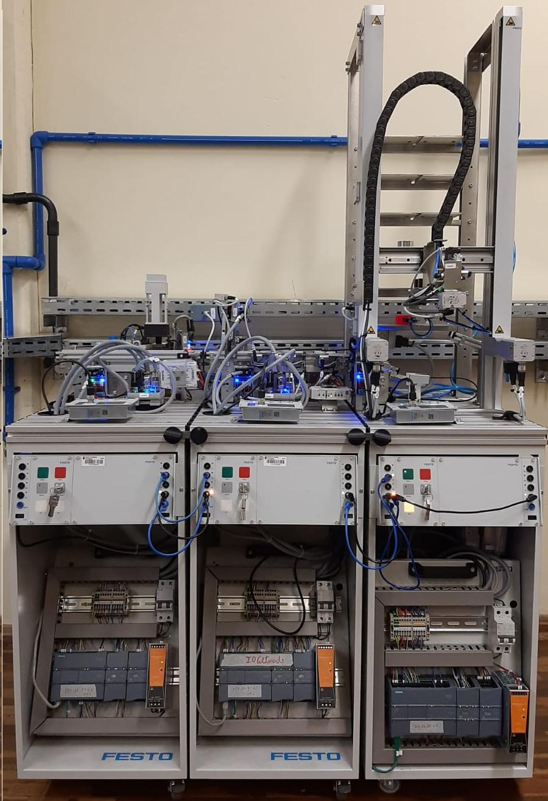

# Bancadas didáticas da FESTO

# Características das bancadas:

## Bancada 1 - Distribuição

- IP do CLP SIEMENS: 172.16.87.61
- CLP e modulos:
	- CLP: SIEMENS S7-1200 CPU 1214C DC/DC/DC;
	- Módulo de entradas e saídas digitais: SM 1223 DI8/DQ8 x 24VDC;
	- Módulo IO-Link: SM 1278, 4 X IO-LINK MASTER;
- Lista de entradas (as entradas dessa estação foram modificadas e não são compatíveis com o projeto original da FESTO):
    - %I0.0: Peça ao início da esteira;
    - %I0.1: Sensor de peça na pilha;
    - %I0.2: Sem peça ao final da esteira;
    - %I0.4: Sensor de pistão retraído;
    - %I0.5: Sensor de pistão avançado;
    - %I8.0: Botão verde (start);
    - %I8.1: Botão vermelho (stop);
    - %I8.2: Chave Auto/Man;
    - %I8.3: Botão cinza (reset);
    - %I8.4: Plug externo;
    - %I8.5: Plug externo;
    - %I8.6: Plug externo;
    - %I8.7: Plug externo;
- Lista de saídas (as saídas dessa estação foram modificadas e não são compatíveis com o projeto original da FESTO):
    - %Q0.0: Move a esteira para a direita;
    - %Q0.1: Move a esteira para a esquerda;
    - %Q0.4: Avança o pistão;
    - %Q8.0: Indicador luminoso do botão verde (start);
    - %Q8.1: Indicador luminoso do botão cinza (reset);
    - %Q8.2: Indicador luminoso Q1;
    - %Q8.3: Indicador luminoso Q2;
    - %Q8.4: Plug externo;
    - %Q8.5: Plug externo;
    - %Q8.6: Plug externo;
    - %Q8.7: Plug externo;

## Bancada 2 - Separação

- IP do CLP SIEMENS: 172.16.87.62
- CLP e modulos:
	- CLP: SIEMENS S7-1200 CPU 1214C DC/DC/DC;
	- Módulo de entradas e saídas digitais: SM 1223 DI8/DQ8 x 24VDC;
	- Módulo IO-Link: SM 1278, 4 X IO-LINK MASTER;
- Lista de entradas (as entradas dessa estação foram modificadas e não são compatíveis com o projeto original da FESTO):
    - %I0.0: Peça ao início da esteira;
    - %I0.1: Defletor 2 estendido;
    - %I0.2: Sensor de peça na rampa;
    - %I0.3: Defletor 3 extendido;
    - %I0.4: Peça detectada no sensor garfo;
    - %I0.5: Peça não preta;
    - %I0.6: Peça metálica;
    - %I8.0: Botão verde (start);
    - %I8.1: Botão vermelho (stop);
    - %I8.2: Chave Auto/Man;
    - %I8.3: Botão cinza (reset);
    - %I8.4: Plug externo;
    - %I8.5: Plug externo;
    - %I8.6: Plug externo;
    - %I8.7: Plug externo;
- Lista de saídas (as saídas dessa estação foram modificadas e não são compatíveis com o projeto original da FESTO):
    - %Q0.0: Move a esteira para a direita;
    - %Q0.1: Estende o defletor 2;
    - %Q0.2: Extende o defletor 3;
    - %Q0.3: Retrair o pistão para bloqueio das peças na esteira;
    - %Q0.4: Extende o defletor 1;
    - %Q8.0: Indicador luminoso do botão verde (start);
    - %Q8.1: Indicador luminoso do botão cinza (reset);
    - %Q8.2: Indicador luminoso Q1;
    - %Q8.3: Indicador luminoso Q2;
    - %Q8.4: Plug externo;
    - %Q8.5: Plug externo;
    - %Q8.6: Plug externo;
    - %Q8.7: Plug externo;

## Bancada 3 - Armazenamento

- IP do CLP SIEMENS: 172.16.87.63
- CLP e modulos:
	- CLP: SIEMENS S7-1200 CPU 1215C DC/DC/DC;
	- Módulo de entradas e saídas digitais: SM 1223 DI8/DQ8 x 24VDC;
	- Módulo IO-Link: SM 1278, 4 X IO-LINK MASTER;
- Lista de entradas (as entradas dessa estação foram modificadas e não são compatíveis com o projeto original da FESTO):
    - %I0.0: Estação na posição inicial;
    - %I0.1: Erro na estação;
    - %I0.2: Estação está ocupada;
    - %I0.3: Área de armazenamento totalmente ocupada;
    - %I0.4: Peça na posição para pegar;
    - %I0.5: Peça metálica;
    - %I0.6: Peça não preta;
    - %I0.7: Peça detectada (sensor garfo);
    - %I8.0: Botão verde (start);
    - %I8.1: Botão vermelho (stop);
    - %I8.2: Chave Auto/Man;
    - %I8.3: Botão cinza (reset);
    - %I8.4: Plug externo;
    - %I8.5: Plug externo;
    - %I8.6: Plug externo;
    - %I8.7: Plug externo;
- Lista de saídas:
    - %Q0.0: Fazer o processo de inicialização (home) da estação;
    - %Q0.1: Reset de erros da estação;
    - %Q0.2: Se desligado indica armazenamento de peças na estação, caso contrário indica remoção de peças da armazenagem;
    - %Q0.3: Código de cores bit 0 (000 = preta, 001 = metálica, 010 = vermelha, 011 = transparente);
    - %Q0.4: Código de cores bit 1 (000 = preta, 001 = metálica, 010 = vermelha, 011 = transparente);
    - %Q0.5: Código de cores bit 2 (000 = preta, 001 = metálica, 010 = vermelha, 011 = transparente);
    - %Q0.6: Strobe (aceita código de cores e inicia processo de armazenagem ou remoção);
    - %Q0.7: Se for zero e estiver em processo de armazenagem, o sistema detecta as cores das peças automaticamente. Caso contrário, os códigos de cores devem ser informados e impulso no strobe inicia o processo;
    - %Q8.0: Indicador luminoso do botão verde (start);
    - %Q8.1: Indicador luminoso do botão cinza (reset);
    - %Q8.2: Indicador luminoso Q1;
    - %Q8.3: Indicador luminoso Q2;
    - %Q8.4: Plug externo;
    - %Q8.5: Plug externo;
    - %Q8.6: Plug externo;
    - %Q8.7: Plug externo;

# Projeto/código de exemplo

- Baixe o arquivo `projeto_clps.ap15_1` e o abra usando o software TIA Portal (no menu `Project`, selecione `Retrieve...`). Essa aplicação foi desenvolvida usando o software TIA Portal v15.1;
- Faça o download do programa em cada CLP, usando os IPs indicados acima. Recomenda-se desabilitar o firewall do windows e no software TIA Portal, procurar o CLP pelo seu endereço IP, ao invés da busca genérica habilitada por default;
- Funcionamento:
    - Bancada 1 - Distribuição:
        - Se tiver peças na pilha, ao clicar no botão verde essas peças serão direcionadas para a bancada 2 (enquanto ela tiver disponibilidade);
    - Bancada 2 - Separação:
        - Se o botão verde estiver ligado, as peças serão separadas de acordo com suas características nas três rampas;
        - Se o botão verde estiver desligado, as peças serão direcionadas para a terceira bancada, caso essa tenha disponibilidade;
    - Bancada 3 - Armazenamento:
        - Antes de iniciar o uso dessa bancada, deve-se inicializar a mesma. Para isso, pressione o botão vermelho por 5 segundos, o que deve ligar o indicador luminoso junto ao botão cinza. Na sequência, pressione o botão cinza, o que fará a estação mover o braço robótico para detectar as suas posições iniciais. Após isso o processo de inicialização está completo e a bancada está pronta para ser utilizada;
        - Ao receber novas peças a estação irá detectar suas características e o braço robótico as armazenará no andar correspondente;
